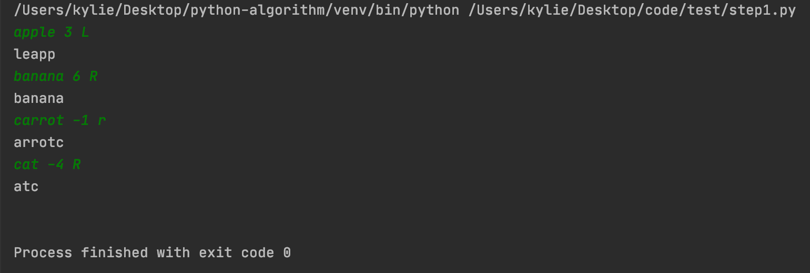
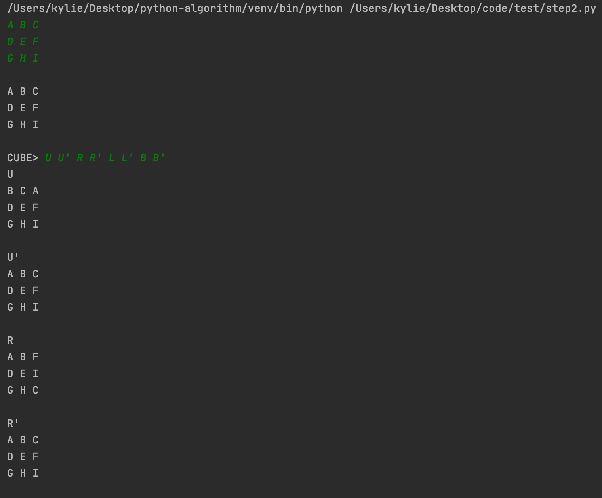

# Rubik's Cube Solution

## step-1
##### 단어 밀어내기 구현하기    

<결과 화면>   
     

입력 값으로 단어(word), 정수(n), 방향(direction)을 입력받는다.    

<n 의 처리 >     
n의 값이 음수면 chk 변수에 체크를 해준다.   
n의 값이 word의 길이보다 길거나 같을 경우 처리를 해준다.   

<direction 값의 처리>        
입력으로 받은 방향의 값에 따라 각각 함수를 구현하였다.     
direction ==  L 또는 l : rotate_left()를 호출한다.   
만약 앞에서 n이 음수일 때 체크한 chk 변수가 1이면 rotate_right()을 호출한다.   
word를 왼쪽으로 밀어내는 구현은 큐(queue)를 사용하여 구현하였다.    
```
def rotate_left():
    global n, word
    q = deque(list(word))

    while n > 0:
        n -= 1
        alpha = q.popleft()
        q.append(alpha)

    q = list(q)
    res = ''

    for x in q:
        res += x
    print(res)
```

direction ==  R 또는 r : rotate_right()를 호출한다.   
만약 앞에서 n이 음수일 때 체크한 chk 변수가 1이면 rotate_left()을 호출한다.   
word를 오른쪽으로 밀어내는 구현은 stack을 사용하여 list의 가장 오른쪽에 있는 값을 pop하고 다시 list의 0번 index에 insert하는 방향으로 구현하였다.   
    
```
def rotate_right():
    global n, word
    stack = list(word)

    while n > 0:
        n -= 1
        alpha = stack.pop()
        stack.insert(0, alpha)

    res = ''

    for x in stack:
        res += x
    print(res)
```


## step-2
##### 평면 큐브 구현하기    

<결과 화면>   
  
    

3X3의 2차원 배열 값을 입력받고 입력받은 초기 평면 큐브를 print_graph() 함수를 통해 출력해주었다.      
```
def print_graph(inp):
    print(inp)
    for k in range(3):
        for m in range(3):
            print(g[k][m], end=' ')
        print()
    print()
```

step-1과 마찬가지로 해당 리스트를 왼쪽으로 밀 때는 rotate_left(리스트, 횟수), 오른쪽으로 밀 때는 rotate_right(리스트, 함수)를 호출하였다.   
전역 변수의 사용을 최소화하기 위해 copy 모듈의 deepcopy()를 사용하여 매개변수로 받은 리스트를 새로운 리스트를 복사해주었다.     
```
def rotate_left(arr, n):
    arr = copy.deepcopy(arr)
    q = deque(arr)
    # 왼쪽으로 밀기
    while n > 0:
        n -= 1
        alpha = q.popleft()
        q.append(alpha)

    q = list(q)
    return q


def rotate_right(arr, n):
    stack = copy.deepcopy(arr)
    # 오른쪽으로 밀기
    while n > 0:
        n -= 1
        alpha = stack.pop()
        stack.insert(0, alpha)

    return stack
```
 
input() 함수를 사용하여 입력받을 때 'CUBE> '를 표시해주었다.   
while문은 "Q"가 입력될 때 종료된다.   
 ```
 while True:
        res = input('CUBE> ')
        # 종료 조건
        if res.startswith("Q"):
            print("Bye~")
            break
```

while 문에서 res의 값이 "Q"가 아닐 때는 res를 list 형으로 바꿔준다.     
해당 조건 (U, B, R, L)에 따라서 회전할 list를 input_arr에 담아서 rotate 함수를 호출한다.       
rotate 함수는 회전된 list를 리턴한다.      
리턴된 output_arr을 평면 큐브 g에 변경해준다.   
 ```
res = list(map(str, res.split()))
input_arr = []
output_arr = []

    for x in res:
        # 가장 윗줄 회전
        if x == "U" or x == "U'":
            input_arr = g[0]
            if x.endswith("'"):
                output_arr = rotate_right(input_arr, 1)
            else:
                output_arr = rotate_left(input_arr, 1)
            g[0] = output_arr

```

## step-3
##### 루빅스 큐브 구현하기    

<결과 화면>      
     
  
  
  

루빅스 큐브는 3X3 배열 6개의 3차원 리스트 g로 구성된다.    
g[0] : 큐브의 앞면이며 색은 O   
g[1] : 큐브의 뒷면이며 색은 Y       
g[2] : 큐브의 왼쪽면이며 색은 W      
g[3] : 큐브의 오른쪽면이며 색은 G      
g[4] : 큐브의 윗면이며 색은 B      
g[5] : 큐브의 아랫면이며 색은 R
        
g의 펼친 상태는 print_graph() 함수로 출력해준다.       
```
def print_graph(m):
    print(m)
    # up 출력
    for i in range(3):
        print('      ', end='')
        for j in range(3):
            print(g[4][i][j], end='')
        print()
    print()

    # left, front, right , back 출력
    for i in range(3):
        for k in (2, 0, 3, 1):
            for j in range(3):
                print(g[k][i][j], end='')
            print('   ', end='')
        print()

    # down 출력
    print()
    for i in range(3):
        print('      ', end='')
        for j in range(3):
            print(g[5][i][j], end='')
        print()
    print()
```


3차원 큐브를 회전시키는 함수는 두 가지로 나눠진다.       
1. 평면 전체가 회전하는 경우 : rotate_full()    
2. 평면의 일부분이 회전하는 경우 : rotate_up(), rotate_front(), rotate_left(), rotate_right(), rotate_back(), rotate_down()   
      
      
평면 전체가 회전할 때는 모서리와 엣지를 기준으로 회전하였다.    
```
def rotate_full(i):
    # 모서리 회전
    tmp = g[i][0][0]
    g[i][0][0] = g[i][2][0]
    g[i][2][0] = g[i][2][2]
    g[i][2][2] = g[i][0][2]
    g[i][0][2] = tmp

    # 엣지 회전
    tmp = g[i][0][1]
    g[i][0][1] = g[i][1][0]
    g[i][1][0] = g[i][2][1]
    g[i][2][1] = g[i][1][2]
    g[i][1][2] = tmp

```

평면의 일부분이 회전하는 함수가 호출되기 전에 회전 조건을 반환하는 함수 get_condition()이 호출된다.    
이 함수는 회전 방향(시계, 반시계)과 회전 횟수를 리턴한다.    
```
def get_condition(m):
    direct = 1
    count = 1

    # 회전 조건 4가지 예: F or F' or F'2 or F2
    if len(m) > 1:
        m = m.split(m[0])[1]
        if m.startswith("'"):
            direct = -1
            if len(m) > 1:
                count = int(m.split("'")[1])
        else:
            count = int(m)
    return direct, count

```
while 문에서 "Q"가 입력되면 프로그램은 종료된다.   
프로그램 경과시간은 처음 시작할 때 선언된 start_time을 통해 종료 시점의 시간과 차이를 통해 구할 수 있다.   
프로그램 조작갯수는 operation 변수를 통해 구한다. res로 들어온 값을 list로 변환하여 operation의 값을 설정해주었다.   

```
    while True:
        if init_chk == 1:
            break
        res = input('CUBE> ')
        # 종료 조건
        if res.startswith("Q"):
            duration = round(time.time() - start_time, 2)
            print("경과시간: " + str(duration) + "s")
            print("조작갯수: " + str(operation))
            print("큐브를 종료합니다...")
            break
```
초기 큐브를 init_g에 복사하여 rotate 하는 중에 큐브의 모든 면을 맞추면 축하메시지와 함께 프로그램은 자동 종료된다.   
```
    init_g = copy.deepcopy(g)
    init_chk = 0

    while True:
        if init_chk == 1:
            break
                .
                .
                .
        # 모든 면을 맞추면 종료
        if init_g == g:
            print("축하합니다! 모든 면을 맞추셨어요. 큐브를 종료합니다...")
            init_chk = 1
            break
```

<결과 화면>
    

만약 입력으로 "mix"가 들어오면 큐브가 무작위로 섞어진다. 1~3의 random 값을 각각 rotate 함수에 적용하여 구현하였다.       
```
def rotate_random():
    rotate_right(random.randrange(1, 4))
    rotate_left(random.randrange(1, 4))
    rotate_up(random.randrange(1, 4))
    rotate_down(random.randrange(1, 4))
    rotate_front(random.randrange(1, 4))
    rotate_back(random.randrange(1, 4))
```

<결과 화면>
    

